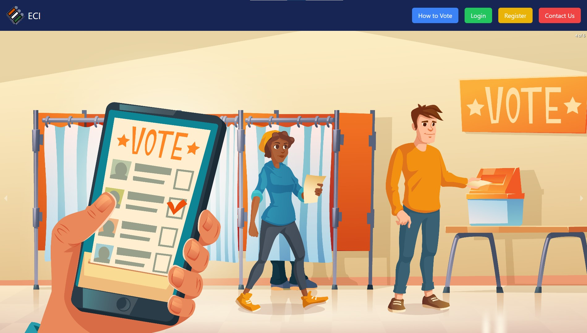

# Online Voting System

## Overview

The Online Voting System is a comprehensive web application developed using the MERN stack (MongoDB, Express.js, React.js, Node.js). It facilitates secure and efficient online voting and provides extensive management features for administrators. The system is designed with role-based access to ensure that both users and admins have appropriate functionalities.

## Features

### User Features:
- **Role-Based Login/Registration:** Users can register and log in with their credentials.
- **View Elections:** Browse and view details of available elections.
- **Vote in Elections:** Cast votes for candidates in active elections.
- **Edit Profile:** Update personal profile information.

### Admin Features:
- **View Registered Voters:** Access a list of all registered voters with gender-wise statistics.
- **Manage Elections:**
  - Add new elections.
  - View and manage existing elections (update or delete).
- **Manage Candidates:**
  - Add candidates to specific elections.
  - View, update, and delete candidate details.
- **Real-Time Vote Analytics:**
  - Visualize real-time vote data using bar and doughnut charts.
- **Manage User Queries:**
  - View and respond to user queries.
  - Delete queries as needed.

## Advantages of Online Voting Systems

- **Accessibility:** Voters can participate from anywhere, increasing overall convenience.
- **Efficiency:** Simplifies and speeds up the voting process, reducing administrative tasks.
- **Real-Time Results:** Provides instant access to voting results and analytics.
- **Security:** Ensures secure voting transactions and data integrity through role-based access and authentication.
- **Cost-Effective:** Lowers costs associated with traditional voting methods such as printing and logistics.

## Technologies Used

- **React.js:** For building the client-side user interface.
- **Node.js:** For server-side JavaScript runtime.
- **Express.js:** For handling server-side logic and API endpoints.
- **MongoDB:** For database management.
- **TailwindCSS:** For styling and responsive design.

## Tech Stack
-
-
-
-
-

- **Other Services:**
  - 

## Screenshot

